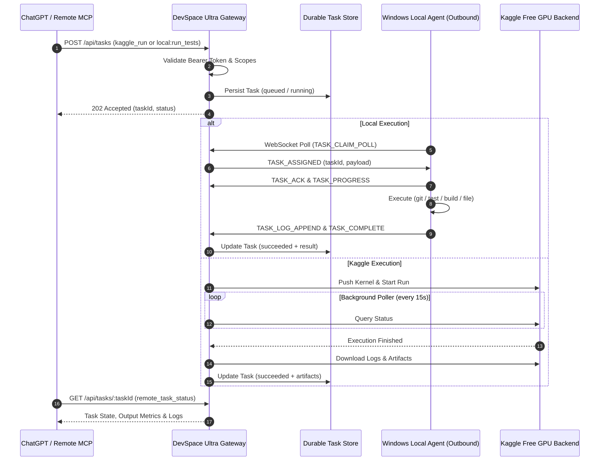

# DevSpace Ultra — System Architecture

## 1. Overview & Data Flow

DevSpace Ultra decouples remote AI clients (like ChatGPT or external orchestrators) from local desktop environments and cloud compute providers using a centralized Gateway and an outbound-only connection model.

---

## 2. Core Components

### 2.1 DevSpace Ultra Gateway
* **HTTP REST API & WebSocket Server**: Express + `ws` serving REST endpoints for task lifecycle and WebSocket endpoints for agent connectivity.
* **AuthManager**: Cryptographically secure token issuer and validator (`dsu_client_*`, `dsu_device_*`).
* **TaskRouter**: Decouples API callers from underlying backends, enforces scopes and idempotency keys.
* **LeaseMonitor**: Background daemon that continuously scans for expired worker leases, reclaiming abandoned tasks back to the queue or marking them stale after retry thresholds.

### 2.2 Storage Layer
* **TaskStore**: ACID-like file-backed task persistence in `.devspace-storage/tasks/`. Tasks survive process crashes, server restarts, and connection loss.
* **ArtifactStore**: Stores logs, results, CSVs, and model checkpoints with SHA256 integrity hashing and size quota limits.
* **IdempotencyStore**: Maintains a sliding-window registry of `clientRequestId` and `idempotencyKey` hashes to prevent duplicate task execution.

### 2.3 Local Agent (Outbound-Only)
* **WebSocket Client**: Initiates outbound connection to `ws://` / `wss://` gateway endpoint.
* **TaskExecutor**: Implements high-level, capability-restricted operations (`local:git_status`, `local:read_file`, `local:patch_file`, `local:run_tests`, `local:build_project`).
* **Heartbeat & Lease Manager**: Renews lease every 10 seconds for all active running tasks.

### 2.4 Kaggle Backend
* **Autonomous Poller**: Pushes kernels to Kaggle, immediately returns a persistent `taskId`, and polls kernel status in background.
* **Artifact Ingestion**: Automatically downloads `stdout.log`, `result.json`, and generated files into the Gateway ArtifactStore upon job completion.
